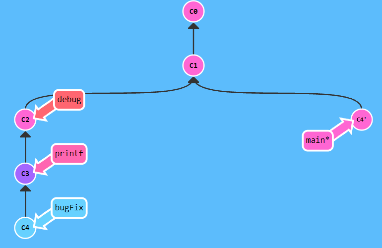

# 基础

## 提交`commit`

命令：`git commit [describe]`

- [describe] 提交说明，可选

>
>
>输入：`git commit`
>
>


## 修改提交

命令

## 分支`branch`

#### 创建分支

**命令**：`git branch  [newBranchName]`


> 
>
> `git  branch  newImage`
>
> 
>
> 创建一个分支其实是创建了一个引用
>
> 创建分支后需要切换到这个分支后才能基于这个分支操作

#### 强制移动分支

**命令**：`git branch  -f   [branchNmae]   [node]`

>`-f` 容许我们将`branch`强制移动到`node`位置。
>
>
>
>命令：`git branch  -f  main  C1`
>
>

#### 删除分支

**命令**：`git branch  -d  [branchName]`

## 切换分支`checkout`

切换分支其实就是将HEAD(指向当前操作的节点的引用)指向对应的分支引用上，HEAD-->分支引用-->节点

**命令**：`git checkout   branchName`

> 这个命令需要保证branchName存在

**命令**：`git checkout  -b   branchName`

> 创建分支并切换到新分支上

## 合并`merge`：


**命令**：`git merge branch1  branch2(默认HEAD)`

> 在 Git 中合并两个分支时会产生一个特殊的提交记录，它有两个父节点。翻译成自然语言相当于：“我要把这两个父节点本身及它们所有的祖先都包含进来。”


> `main` 现在指向了一个拥有两个父节点的提交记录。假如从 `main` 开始沿着箭头向上看，在到达起点的路上会经过所有的提交记录。这意味着 `main` 包含了对代码库的所有修改。

## 移动`rebase`：

   **git rebase main  →**   

**命令**：`git rebase branch1  branch2(默认HEAD)`

>Rebase 实际上就是取出一系列的提交记录，“复制”它们，然后在另外一个地方逐个的放下去.
>
>Rebase 的优势就是可以创造更线性的提交历史，这听上去有些难以理解。如果只允许使用 Rebase 的话，代码库的提交历史将会变得异常清晰。
>
>从节点b向上找到第一个非节点a父级的节点c，然后将c-a的拷贝移动到节点a，HEAD--->b，如果a是用分支名标记，则HEAD--->分支名--->b


# 高级

## 分离HEAD

我们首先看一下 “HEAD”。 HEAD 是一个对当前检出记录的符号引用 —— 也就是指向你正在其基础上进行工作的提交记录。

>HEAD 总是指向当前分支上最近一次提交记录。大多数修改提交树的 Git 命令都是从改变 HEAD 的指向开始的。
>
>HEAD 通常情况下是指向分支名的（如 bugFix）。在你提交时，改变了 bugFix 的状态，这一变化通过 HEAD 变得可见。

分离的 HEAD 就是让其指向了某个具体的提交记录而不是分支名。在命令执行之前的状态如下所示：

> HEAD -> main -> C1
>
> HEAD 指向 main， main 指向 C1

执行后

> HEAD->C1
>
> HEAD直接指向C1节点


**命令**：`git checkout  节点`

> HEAD如果指向分支，会随分支一起移动

## 相对引用

在git中，我们通过`hash`值来唯一标识节点，但实际中是基于 `SHA-1`，共 40 位的哈希，使用极不方便，git因此又引入了**相对引用**的方式，方便我们表示**节点**.

使用相对引用的话，你就可以从一个易于记忆的地方（比如 `bugFix` 分支或 `HEAD`）开始计算。

相对引用非常给力，这里我介绍两个简单的用法：

- 使用 `^` 向上移动 1 个提交记录

  >把这个符号加在**引用名称**的后面，表示让 Git 寻找指定提交记录的**父提交**。
  >
  >所以 `main^` 相当于“`main` 的**父节点**”。
  >
  >`main^^` 是 `main` 的**第二个父节点**
  >
  >
  >
  >输入：`git checkout  bugFix^`
  >
  >

- 使用 `~<num>` 向上移动多个提交记录，如 `~3`

  >该操作符后面可以跟一个数字（可选，不跟数字时与 `^` 相同，向上移动一次），指定向上移动多少次。咱们还是通过实际操作看一下吧
  >
  >
  >
  >输入： `git  chcekout  HEAD~4`
  >
  >

**这两种相对引用的使用是可以叠加的**！

>`git checkout HEAD~2^`
>
>表示切换到HEAD向上两个节点的父级

## 撤销变更reset&revert

#### 本地分支reset

**命令**： `git reset [--soft | --mixed | --hard] [node]`

- **--mixed** 为默认，可以不带该参数，用于重置暂存区的文件与上一次的提交(commit)保持一致，工作区文件内容保持不变。
- **--soft** 参数用于回退到某个版本
- **--hard** 参数撤销工作区中所有未提交的修改内容，将暂存区与工作区都回到上一次版本，并删除之前的所有信息提交
- [node] **必须是HEAD的祖先节点**

>`git reset` 通过把分支记录回退几个提交记录来实现撤销改动。你可以将这想象成“改写历史”。`git reset` 向上移动分支，原来指向的提交记录就跟从来没有提交过一样。
>
>**！！！仅本地仓库有效！！！**
>
>
>
>输入： `git  reset   HEAD~1`
>
>
>
>Git 把 main 分支移回到 `C1`；现在我们的本地代码库根本就不知道有 `C2` 这个提交了。

#### 远程分支revert

**命令**: `git  revert  [node]`  

>
>
>输入： `git   revert   HEAD`
>
>
>
>在我们要撤销的提交记录后面多了一个新提交！这是因为新提交记录 `C2'` 引入了**更改** —— 这些更改刚好是用来撤销 `C2` 这个提交的。也就是说 `C2'` 的状态与 `C1` 是相同的。

# 移动提交记录

## `cherry-pick` 

**命令**：`git cherry-pick  [node1]  [node2]  node[3] ...` 

>将一些提交复制到当前所在的位置（`HEAD`）下面
>
>
>
>输入： `git  cherry-pick  C2  C4`
>
>

## 交互式移动`rebase`

**命令**：`git rebase -i [node]`

>从`HEAD`到参数节点的所有节点拷贝一份，可以移动顺序，再作为节点a的一个分支唤出rebase UI
>
>当 rebase UI界面打开时, 你能做3件事:
>
>- 调整提交记录的顺序
>- 删除你不想要的提交
>- 合并提交。
>
>
>
>输入： `git   rebase   -i   HEAD~4`
>
>唤出rebase  UI
>
>
>
>调整顺序后确认
>
>
>
>节点按调整的顺序进行了拷贝
>
>


# 杂项

## 本地栈式提交


来看一个在开发中经常会遇到的情况：我正在解决某个特别棘手的 Bug，为了便于调试而在代码中添加了一些调试命令并向控制台打印了一些信息。

这些调试和打印语句都在它们各自的提交记录里。最后我终于找到了造成这个 Bug 的根本原因，解决掉以后觉得沾沾自喜！


最后就差把 `bugFix` 分支里的工作合并回 `main` 分支了。你可以选择通过 fast-forward 快速合并到 `main` 分支上，但这样的话 `main` 分支就会包含我这些调试语句了。你肯定不想这样，应该还有更好的方式……

事实上只要移动提交记录就可以了。

有如下两种方法:

1. `cherry-pick`

   > 先切换`HEAD`到主分支
   >
   > `git checkout main`
   >
   > 选择`bugFix`拷贝引用到`HEAD`
   >
   > `git cherry-pick bugFix`
   >
   > 

2. 交互式`rebase`

   > `git rebase -i HEAD~3`
   >
   > 
   >
   > `git rebase bugFix main`
   >
   > 将main更新到bugFix上，由于main是bugFix的祖先，所以不会创建新的拷贝
   >
   > 


## 提交技巧

开发中我们会遇到各种情况，接下来我们简单讲述一下买对下面这种情况怎么办

你之前在 `newImage` 分支上进行了一次提交，然后又基于它创建了 `caption` 分支，然后又提交了一次。

此时你想对某个以前的提交记录进行一些小小的调整。比如设计师想修改一下 `newImage` 中图片的分辨率，尽管那个提交记录并不是最新的了。

1. `rebase`实现

   > 
   >
   > 
   >
   > 将要修改的提交放到底部
   >
   > `git rebase -i  main`
   >
   > 
   >
   > 修改内容后提交
   >
   > `git commit --amend`
   >
   > 
   >
   > 重新调整顺序
   >
   > `git rebase -i main`
   >
   > 
   >
   > 将main更新
   >
   > `git branch -f main` 
   >
   > 
   >
   
2. `cherry-pick`实现

   > 
   >
   > 切换到要修改的提交上
   >
   > `git checkout newImage`
   >
   > 修改提交
   >
   > `git commit --amend`
   >
   > 
   >
   > 切换到主分支上
   >
   > `git checkout main`
   >
   > 调整提交顺序并更新主分支
   >
   > `git cherry-pick newImage caption`
   >
   > 


## 标签`git tag`

实际中的git并没有像图片一样的节点树供我们参考，每个节点的哈希值都极长，我们并没有那么容易确定到一次提交，有些同学可能想到了分支名引用，很好，但是随着我们的commit，分支引用会不断的修改，没有办法恒久的记录节点，好在git设计者早就为我们做好了铺垫，有一个叫做**标签**（`tag`）的不知道你有没有听过呢？

#### 定义

> 标签：一个固定的引用，永久地将某个特定的提交命名为里程碑，然后就可以像分支一样引用了。

#### 创建标签

**命令**：`git tag [tagName] [node]`

> 
>
> 输入：`git tag V1  C1`
>
> 

#### 使用标签

标签的使用和分支名一样，也可以在其上使用相对引用，这里就不演示了

## git describe

#### 介绍

> 由于标签在代码库中起着“锚点”的作用，Git 还为此专门设计了一个命令用来**描述**离你最近的锚点（也就是标签），它就是 `git describe`！
>
> Git Describe 能帮你在提交历史中移动了多次以后找到方向；当你用 `git bisect`（一个查找产生 Bug 的提交记录的指令）找到某个提交记录时，或者是当你坐在你那刚刚度假回来的同事的电脑前时， 可能会用到这个命令。

#### 语法

>`git describe` 的语法是：
>
>```
>git describe <ref>
>```
>
>`<ref>` 可以是任何能被 Git 识别成提交记录的引用，如果你没有指定的话，Git 会以你目前所检出的位置（`HEAD`）。
>
>它输出的结果是这样的：
>
>```
><tag>_<numCommits>_g<hash>
>```
>
>`tag` 表示的是离 `ref` 最近的标签， `numCommits` 是表示这个 `ref` 与 `tag` 相差有多少个提交记录， `hash` 表示的是你所给定的 `ref` 所表示的提交记录哈希值的前几位。
>
>当 `ref` 提交记录上有某个标签时，则只输出标签名称

#### 演示

> 先有如下仓库
>
> 
>
> 输入：`git describe`
>
> 输出：V1_2_gC6
>
> 
>
> 输入：`git describe main`
>
> 输出：V0_2_gC2


# 高级话题

## 多次rebase

## 两个父节点

## 纠缠不清的分支
